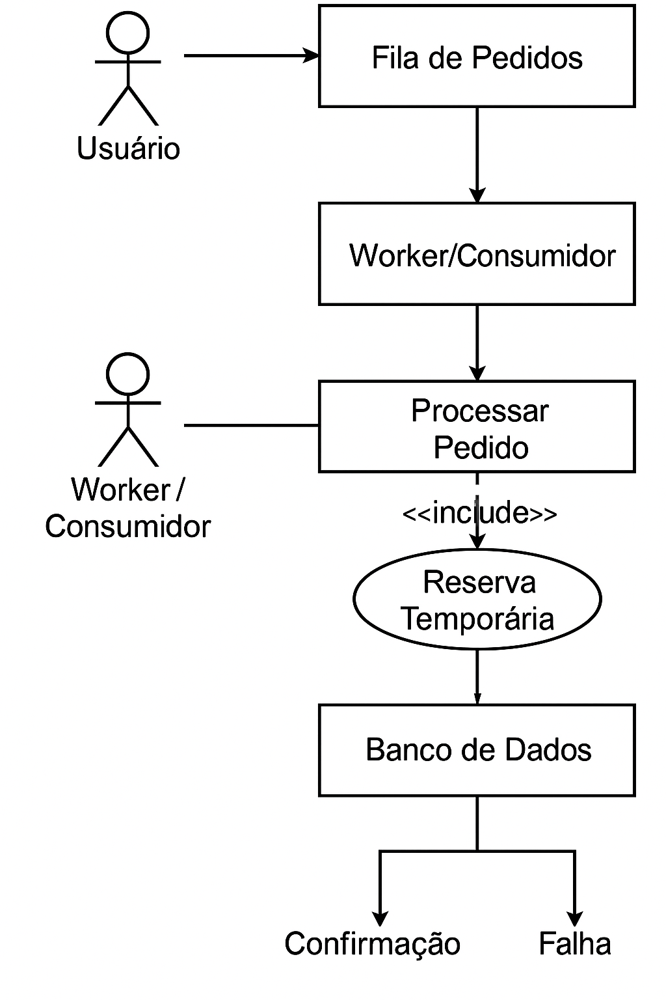

# Arquitetura de Venda de Ingressos para Eventos de Alta Concorrência

Este repositório apresenta a proposta de arquitetura para o sistema de vendas de ingressos do mega show **Rock in Rio**, com foco em **controle de concorrência, escalabilidade e justiça na distribuição de ingressos**.

## Descrição da Solução

O sistema foi desenhado para garantir que:

- Nenhum ingresso seja vendido além do estoque disponível (**sem overbooking**);
- Os pedidos sejam processados **em ordem de chegada**, independente da velocidade da conexão do usuário;
- A arquitetura seja escalável para lidar com grandes volumes de acesso simultâneo.

## Diagrama da Arquitetura

A imagem abaixo ilustra o fluxo principal do sistema:

## Componentes do Sistema

### Usuário

O processo se inicia com o usuário acessando o sistema para comprar um ingresso. Em vez de processar o pedido diretamente, o sistema adota uma abordagem com fila ordenada para garantir justiça no atendimento.

---

### Fila de Pedidos

As requisições de compra são colocadas em uma **fila distribuída**, como Kafka, Redis Streams ou Amazon SQS.  
Isso garante que os pedidos serão processados de forma sequencial e controlada, respeitando a **ordem de chegada**.

---

### Worker/Consumidor

Um componente do tipo **Worker/Consumer** consome os pedidos da fila e processa um a um. Essa camada desacopla a entrada de requisições do processamento real, possibilitando escalabilidade horizontal e controle total sobre a concorrência.

---

### Processar Pedido + Reserva Temporária

Cada pedido passa pela etapa de **validação de dados** e **reserva temporária de ingresso**:

- O sistema cria um "soft lock" (ex: chave no Redis com TTL ou status reservado no banco relacional);
- A reserva garante que o ingresso não será vendido para outra pessoa enquanto o cliente finaliza o pagamento;
- Caso o pagamento não seja concluído em tempo hábil, o ingresso retorna ao estoque automaticamente.

---

### Banco de Dados

A persistência das reservas e atualizações de estoque é feita em um banco de dados transacional ou memória com consistência forte, como:

- PostgreSQL com transações;
- Redis com TTL e atomicidade via scripts Lua.

---

### Confirmação ou Falha

Após o processamento, o sistema responde:

- **Confirmação**, caso o ingresso tenha sido reservado com sucesso;
- **Falha**, se o estoque estiver esgotado ou a reserva expirar.

---

## Benefícios da Arquitetura

- Garante justiça na distribuição  
- Evita overselling mesmo com acessos simultâneos  
- Escalável horizontalmente com múltiplos Workers  
- Respeita a ordem de chegada dos usuários  
- Protege contra bots e requisições paralelas maliciosas

---

## Tecnologias Sugeridas

- Fila: Kafka, Redis Streams, Amazon SQS  
- Banco de Dados: PostgreSQL, Redis  
- Aplicação: .NET, Node.js, Java, Go  
- Monitoramento: Prometheus, Grafana, Sentry  
- Proteções adicionais: Captcha, Rate Limiting, JWT

---

**Obs.:** Essa arquitetura pode ser reutilizada para qualquer cenário de alta concorrência com estoque limitado, como vendas de consoles, passagens aéreas, etc.
